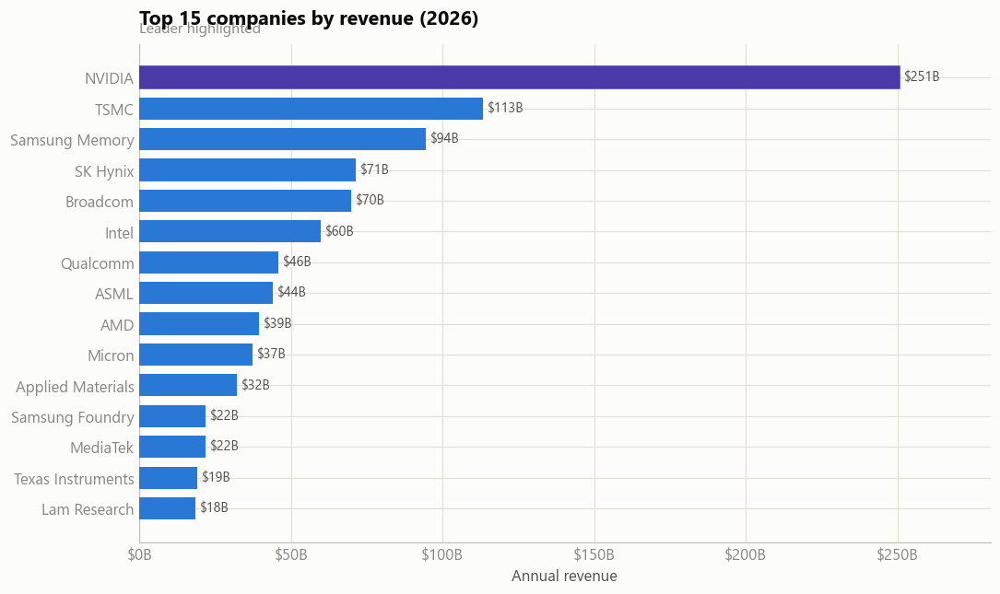
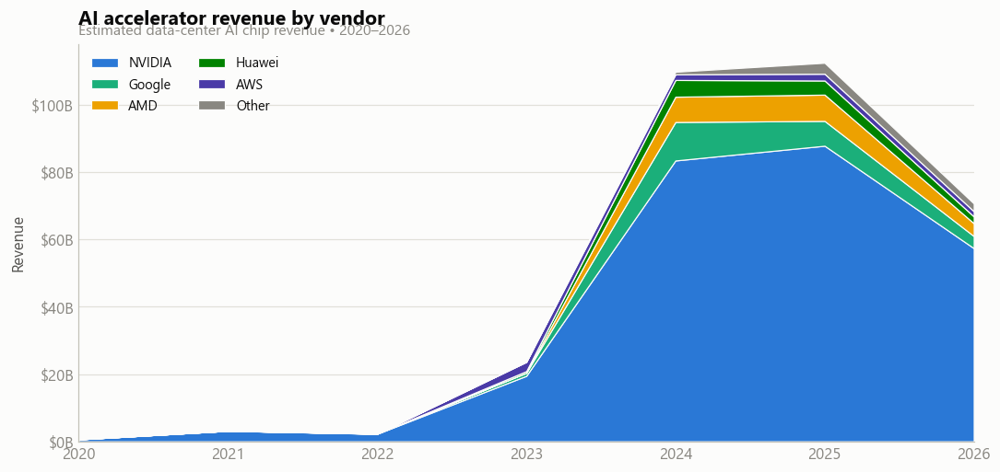
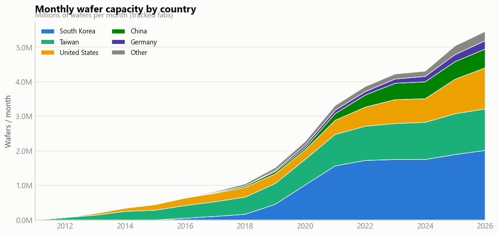
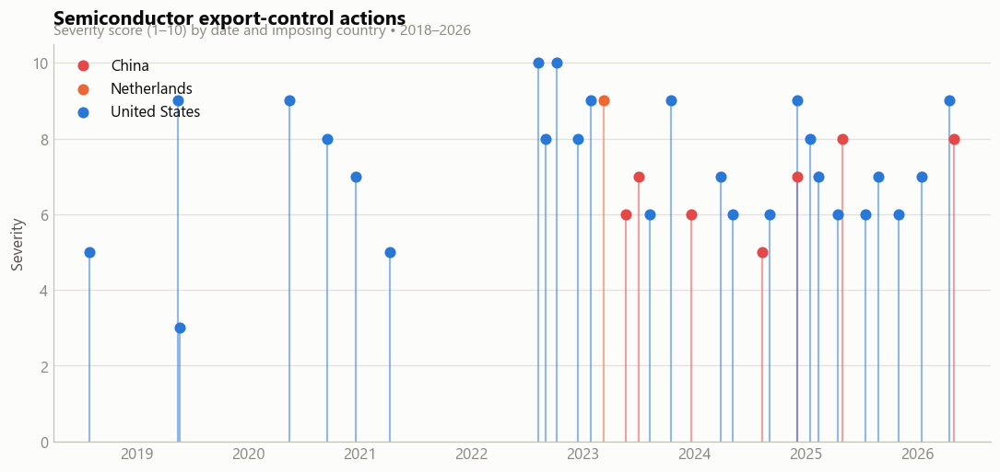

# 🌐 Global Semiconductor Industry Analysis

An exploratory data analysis project examining the global semiconductor industry from 2010 to 2026, including revenue, AI-chip growth, investment, memory prices, fab capacity, and export controls.

## 🎯 Objectives

- Measure tracked industry revenue and business-model mix.
- Compare leading semiconductor companies by revenue.
- Explore AI accelerator growth and market concentration.
- Study R&D, capital expenditure, memory-price cycles, and fab capacity.
- Visualize the geopolitical impact of export-control actions.

## 📊 Data Sources in This Project

- `chip_companies_financials.csv` — company revenue, R&D, and capex
- `ai_chip_market.csv` — AI accelerator vendors and compute metrics
- `chip_prices.csv` — memory and semiconductor product prices
- `fab_capacity.csv` — wafer capacity by country and process node
- `export_controls.csv` — export-control dates, countries, and severity

## 🔎 Analysis Covered

- Revenue trends and business-model breakdown
- Top-company revenue ranking
- R&D and capex investment trends
- AI accelerator revenue and vendor concentration
- Indexed and absolute chip-price trends
- Fab capacity by country and leading-edge process share
- Export-control timeline and annual action counts

## 🗂️ Project Structure

~~~text
Analysis/
├── global-semiconductor-eda.ipynb
├── ai_chip_market.csv
├── chip_companies_financials.csv
├── chip_prices.csv
├── export_controls.csv
├── fab_capacity.csv
├── semiconductor_top_companies.png
├── semiconductor_ai_revenue.png
├── semiconductor_fab_capacity.png
├── semiconductor_export_controls.png
└── README.md
~~~

## 🛠️ Technology Stack

- Python
- pandas and NumPy
- Matplotlib and Seaborn
- Jupyter Notebook

## 🚀 Getting Started

~~~bash
pip install pandas numpy matplotlib seaborn jupyter
jupyter notebook global-semiconductor-eda.ipynb
~~~

## 📌 Notes

This is an exploratory portfolio project. Industry trends and estimates should be interpreted in the context of the project datasets and assumptions.

## 👤 Author

**Vishal Yadav**

Part of the [EDA Project Portfolio](https://github.com/Vishal123-tech/EDA-PROJECT-).
