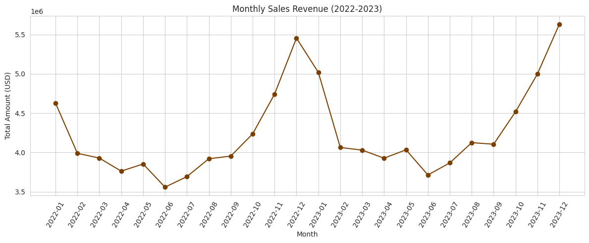

# 🍫 Chocolate Sales 2022–2023 — End-to-End Analytics

An end-to-end analytics project that turns order-level chocolate sales data into business insights, demand predictions, and decision-ready reporting.

> **Project question:** Which products, markets, channels, and commercial levers drive revenue and shipment volume—and how can demand be predicted for planning?

---

## 📌 Project overview

This project follows a complete analytics workflow: data-quality investigation, cleaning, exploratory analysis, predictive modeling, model interpretation, SQL business analysis, and dashboard planning.

The analysis answers questions such as:

- Which products and countries drive the most revenue?
- Which sales channels are most valuable?
- Is the expected Valentine's Day or holiday seasonality present?
- Does discounting increase shipment volume?
- Which channels generate the strongest marketing return?
- Which factors best predict boxes shipped?

## 🗂️ Repository contents

~~~text
Chocolate Sales in 2022–2023/
├── Chocolate_Sales_Analysis.ipynb   # Cleaning, EDA, modeling, and SQL analysis
├── Chocolate_Sales.csv              # Raw order-level dataset
├── chocolate-analysis.png           # README visualization
└── README.md                         # Project documentation
~~~

The broader project also supports a cleaned CSV, PostgreSQL business queries, a Power BI dashboard, a written report, and a presentation deck when those artifacts are included in the project folder.

## 🧾 Dataset

The raw dataset contains order-level chocolate sales records with the following fields:

| Field | Type | Description |
| --- | --- | --- |
| Order_ID | Text | Unique order identifier |
| Product | Categorical | Chocolate product ordered |
| Country | Categorical | Customer or market country |
| Channel | Categorical | Sales channel, such as Retail or Wholesale |
| Salesperson | Categorical | Salesperson associated with the order |
| Order_Date | Date | Date of the order |
| Discount_Pct | Numeric | Discount applied to the order |
| Price_per_Box | Numeric | Price per box |
| Marketing_Spend | Numeric | Marketing spend associated with the order |
| Boxes_Shipped | Numeric | Number of boxes shipped |
| Amount | Numeric | Order revenue in USD |

## 🧹 Data cleaning

The notebook documents each data-quality decision instead of applying unexplained blanket fixes:

- Removes the dollar symbol from Amount and converts it to numeric.
- Drops rows without a reliable Order_Date.
- Parses mixed date formats and removes genuinely ambiguous dates.
- Converts negative Boxes_Shipped values caused by sign-entry errors.
- Imputes missing Discount_Pct, Price_per_Box, and Marketing_Spend values with product-wise medians.
- Keeps Amount as the source of truth when it differs from Boxes_Shipped × Price_per_Box and documents the discrepancy.

## 🔍 Analysis workflow

1. Load and profile the raw order data.
2. Clean dates, numeric fields, missing values, and sign errors.
3. Build monthly revenue, country, channel, product, and salesperson summaries.
4. Test seasonality, discount effectiveness, and marketing ROI.
5. Compare Linear Regression, Random Forest, XGBoost, and LightGBM models.
6. Use SHAP to explain the strongest demand drivers.
7. Query the cleaned data with PostgreSQL using business-focused SQL.
8. Prepare outputs for dashboard and presentation use.

## 📈 Key findings

- The core products—70% Dark Bar, Mixed Assortment Box, and Truffle Gift Box—drive approximately 63.7% of total revenue.
- November and December show a repeatable holiday-season demand uplift, while Valentine's Day is not the strongest seasonal period in this dataset.
- Wholesale marketing produces the strongest reported return, at approximately $6.60 in revenue per marketing dollar.
- The LightGBM demand model achieves an R² of approximately 0.728 in the notebook evaluation.
- Price per box and marketing spend are the most influential demand drivers according to the SHAP analysis.

> The dataset shows signs of being synthetic, including a salesperson order-share anomaly and an Amount calculation mismatch. Findings should therefore be treated as a methodology demonstration rather than a definitive business diagnosis.

## 🤖 Predictive modeling

The modeling objective is to predict Boxes_Shipped from product, country, channel, salesperson, discount, price, marketing spend, and seasonal features.

Models compared:

- Linear Regression baseline
- Random Forest Regressor
- XGBoost Regressor
- LightGBM Regressor

LightGBM is selected for interpretation because it achieved the marginally higher R². SHAP feature importance is then used to explain the model's demand predictions.

## 🗄️ PostgreSQL and business analysis

The cleaned data can be loaded into PostgreSQL for queries covering:

- Top products by country
- Channel profitability and average order value
- Year-over-year growth
- Discount effectiveness
- Salesperson rankings
- Monthly month-over-month growth
- Marketing ROI by channel
- Product revenue Pareto analysis

## 🛠️ Tech stack

- Python
- pandas and NumPy
- Matplotlib and Seaborn
- scikit-learn
- XGBoost and LightGBM
- SHAP
- PostgreSQL
- Power BI
- Jupyter Notebook

## 🚀 Getting started

Clone the repository and open the project folder:

~~~bash
git clone https://github.com/Vishal123-tech/EDA-PROJECT-.git
cd EDA-PROJECT-/Chocolate\ Sales\ in\ 2022–2023
~~~

Install the Python libraries required for the notebook:

~~~bash
python -m pip install pandas numpy matplotlib seaborn scikit-learn xgboost lightgbm shap sqlalchemy psycopg2-binary jupyter
~~~

Launch the notebook:

~~~bash
jupyter notebook Chocolate_Sales_Analysis.ipynb
~~~

For a local run, load the included raw file with:

~~~python
pd.read_csv("Chocolate_Sales.csv")
~~~

The PostgreSQL section is optional; the cleaning, EDA, and modeling sections can be run without a local database connection.

## 📚 Data source and attribution

The notebook identifies the source as the Kaggle **Chocolate Sales in 2022–2023** dataset. Please review the original dataset license and attribution requirements before redistributing or using it commercially.

## 📄 License

No project-specific license has been added. Unless a license is provided, default copyright rules apply to the original work in this repository.
