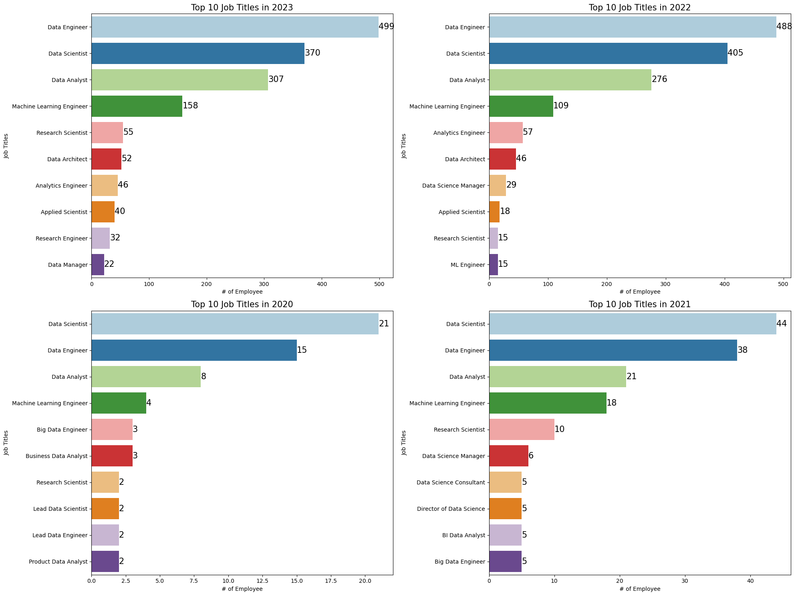

# 📊 Data Science Salary — Exploratory Data Analysis

An exploratory data analysis project that investigates salary patterns across data science roles, experience levels, employment types, locations, remote-work arrangements, and company sizes.

> **Project question:** What patterns can we uncover in data science salaries, job demand, and workforce characteristics across different years and experience levels?

---

## 📌 Project overview

This project uses Python-based exploratory data analysis to transform a raw salary dataset into clear, interpretable insights. The notebook combines data profiling, categorical-label cleaning, statistical summaries, and visual storytelling.

The analysis focuses on:

- The most common data-related job titles by year
- Job-title patterns across experience levels
- Employment-type distribution
- Salary distributions and compensation patterns
- Employee residence and company location
- Remote-work ratio and company size

## 🗂️ Repository contents

~~~text
Data Science Salary/
├── Data_Science_Salary-EDA.ipynb   # Complete exploratory analysis
├── ds_salaries.csv                 # Source dataset
├── salary-analysis.png             # README visualization
└── README.md                       # Project documentation
~~~

## 🧾 Dataset

The dataset contains **data science salary records** with the following fields:

| Field | Type | Description |
| --- | --- | --- |
| work_year | Numeric | Year in which the salary was reported |
| experience_level | Categorical | Employee experience level |
| employment_type | Categorical | Full-time, part-time, contract, or freelance |
| job_title | Categorical | Data-related job title |
| salary | Numeric | Salary in the original currency |
| salary_currency | Categorical | Original salary currency |
| salary_in_usd | Numeric | Salary normalized to US dollars |
| employee_residence | Categorical | Employee's country of residence |
| remote_ratio | Numeric | Percentage of remote work |
| company_location | Categorical | Company's country |
| company_size | Categorical | Small, medium, or large company |

## 🔍 Analysis workflow

1. Import Python libraries and configure the display format.
2. Load the salary dataset into a pandas DataFrame.
3. Inspect shape, data types, missing values, duplicates, unique values, and summary statistics.
4. Separate categorical and numerical variables.
5. Expand abbreviated category labels for clearer interpretation.
6. Compare job titles by work year and experience level.
7. Visualize employment type and salary distributions.
8. Summarize the main patterns observed in the data.

## 📈 Key visual analysis

### Top job titles by year

The project compares the most frequent job titles across the available years. Data Engineer, Data Scientist, Data Analyst, and Machine Learning Engineer appear among the most prominent roles in the analysis.

### Experience and employment

The notebook explores how roles are distributed across experience levels and employment types, helping identify where the dataset is concentrated.

### Salary distributions

Salary values are examined using normalized US-dollar compensation to make comparisons more meaningful across the original currencies represented in the dataset.

## 💡 Key takeaways

- Data Engineer, Data Scientist, and Data Analyst are consistently prominent job titles in the dataset.
- Senior-level roles form a major part of the available salary records.
- Remote-work arrangements and company size provide useful context when comparing compensation.
- Using salary_in_usd supports more consistent salary comparisons than using the original currency values.
- Clear category labels make the visualizations easier to understand and communicate.

> These observations describe patterns in this dataset and should not be interpreted as a complete representation of the entire global data-science labor market.

## 🛠️ Tech stack

- Python
- pandas
- NumPy
- Matplotlib
- Seaborn
- Jupyter Notebook

## 🚀 Getting started

Clone the repository and open the project folder:

~~~bash
git clone https://github.com/Vishal123-tech/EDA-PROJECT-.git
cd EDA-PROJECT-/Data\ Science\ Salary
~~~

Install the required libraries:

~~~bash
python -m pip install pandas numpy matplotlib seaborn jupyter
~~~

Launch the notebook:

~~~bash
jupyter notebook Data_Science_Salary-EDA.ipynb
~~~

When running locally, make sure the notebook loads the included CSV file:

~~~python
pd.read_csv("ds_salaries.csv")
~~~

## 📚 Data source and attribution

The project uses the **Data Science Salaries 2023** dataset. Please review the original dataset's license and attribution requirements before redistributing or using it commercially.

## 📄 License

No project-specific license has been added. Unless a license is provided, default copyright rules apply to the original work in this repository.
