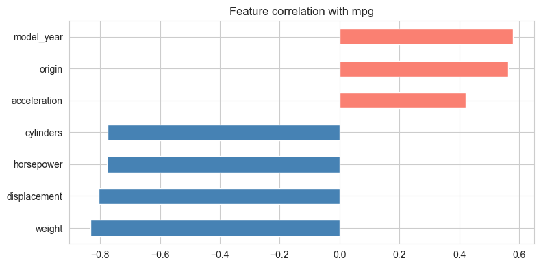

# Fuel Efficiency Prediction (Auto MPG)

A beginner-level **regression** project that predicts a car's fuel efficiency (MPG, miles per gallon) from its engine and chassis attributes.

## Problem Statement

Given a car's cylinders, engine displacement, horsepower, weight, acceleration, model year, and origin, predict its fuel efficiency in miles per gallon.

## Dataset

- **Source:** [UCI Auto MPG Data Set](https://archive.ics.uci.edu/dataset/9/auto+mpg)
- **Samples:** 398 cars from model years 1970 to 1982
- **Target:** \`mpg\`, measured in miles per gallon
- **Missing data:** 6 horsepower values, handled during cleaning

| Feature | Description |
| --- | --- |
| \`cylinders\` | Number of engine cylinders |
| \`displacement\` | Engine displacement in cubic inches |
| \`horsepower\` | Engine horsepower |
| \`weight\` | Vehicle weight in pounds |
| \`acceleration\` | Acceleration time in seconds |
| \`model_year\` | Vehicle model year |
| \`origin\` | Region of manufacture: USA, Europe, or Japan |
| \`mpg\` | Fuel-efficiency target |

## 🔎 What the graph shows

The graph above is taken from the exploratory analysis notebook. It compares each numeric feature's correlation with MPG:

- Weight is the strongest negative relationship with fuel efficiency.
- Displacement, horsepower, and cylinders are also negatively related to MPG.
- Model year has a positive relationship with MPG.
- The analysis shows why vehicle size and engine characteristics are important for predicting fuel efficiency.

## 🗂️ Project Structure

~~~text
Fuel Efficiency Prediction/
├── 01_eda.ipynb
├── 02_data_cleaning.ipynb
├── 03_model_building.ipynb
├── utils.py
├── requirements.txt
├── fuel_efficiency_target_correlations.png
├── README.md
└── data/
    ├── auto_mpg.csv
    └── auto_mpg_cleaned.csv
~~~

Run the notebooks in order: \`01_eda.ipynb\` → \`02_data_cleaning.ipynb\` → \`03_model_building.ipynb\`.

## 📈 Model Results

Seven regression models were evaluated. The tuned Random Forest achieved the strongest baseline performance:

| Model | R² | RMSE | MAE |
| --- | ---: | ---: | ---: |
| Random Forest | 0.9173 | 2.11 | 1.59 |
| Gradient Boosting | 0.9010 | 2.31 | 1.66 |
| Linear Regression | 0.8807 | 2.53 | 1.93 |
| Random Forest (Tuned) | **0.9164** | **2.12** | **1.59** |

## 🛠️ Technology Stack

- Python
- pandas and NumPy
- Matplotlib and Seaborn
- scikit-learn
- Jupyter Notebook

## 🚀 Getting Started

~~~bash
pip install -r requirements.txt
jupyter notebook 01_eda.ipynb
~~~

## 👤 Author

**Vishal Yadav**

Part of the [EDA Project Portfolio](https://github.com/Vishal123-tech/EDA-PROJECT-).
