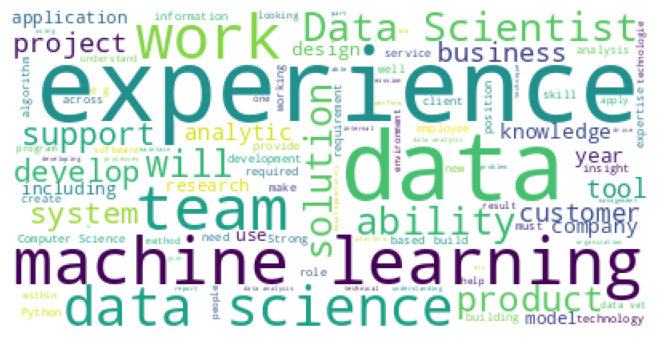

# 💼 Glassdoor Data Science Jobs — Cleaning & Exploratory Analysis

An end-to-end data-cleaning and exploratory analysis project built from Glassdoor data-science job postings. The project transforms scraped job data into structured salary, company, location, seniority, and skill insights.

> **Project question:** What can job-posting data reveal about data-science salaries, roles, employers, locations, company characteristics, and in-demand technical skills?

---

## 📌 Project overview

This project begins with scraped Glassdoor job-posting data and documents the process of preparing it for analysis. The notebook combines data-quality fixes, feature extraction, text-based skill detection, and exploratory visualization.

The analysis focuses on:

- Estimated salary ranges by job role and location
- Job-title and seniority patterns
- Company ratings, size, age, industry, and sector
- Geographic distribution of job postings
- Technical skills mentioned in job descriptions
- Relationships among salary, rating, company characteristics, and role type

## 🗂️ Repository contents

~~~text
Glassdoor/
├── Uncleaned_DS_jobs.csv             # Original scraped dataset
├── Cleaned_DS_Jobs.csv               # Cleaned and feature-engineered dataset
├── glassdoor_data_cleaning_eda.ipynb # Complete analysis notebook
├── glassdoor-analysis.png            # README visualization
└── README.md                         # Project documentation
~~~

## 🧾 Dataset

The raw dataset contains **672 data-science job postings** with fields including:

| Field | Description |
| --- | --- |
| Job Title | Advertised role title |
| Salary Estimate | Estimated salary range from the posting |
| Job Description | Full text of the job advertisement |
| Rating | Company rating |
| Company Name | Employer name |
| Location | Job location |
| Headquarters | Company headquarters |
| Size | Employee-size category |
| Founded | Company founding year |
| Type of ownership | Ownership structure |
| Industry | Company industry |
| Sector | Business sector |
| Revenue | Reported revenue category |
| Competitors | Listed competitors |

## 🧹 Data cleaning

The notebook documents the following transformations:

- Standardizes column names to lowercase, underscore-separated names.
- Removes the unnecessary index column and duplicate rows.
- Replaces scraped `-1` values with an explicit unknown category.
- Standardizes job-title abbreviations such as Senior and Junior.
- Removes currency symbols, salary suffixes, and estimate labels from salary ranges.
- Cleans newline characters from job descriptions.
- Removes rating text accidentally appended to company names.
- Standardizes employee-size ranges and revenue labels.

## 🧪 Feature engineering

The cleaned dataset adds analysis-ready fields, including:

- `min_salary`, `max_salary`, and `avg_salary`
- `job_state` and `same_state`
- `company_age`
- Skill flags for Python, Excel, Hadoop, Spark, AWS, Tableau, and big data
- Simplified job categories through `job_simp`
- Seniority classification through `seniority`

These features make it possible to compare compensation, demand, and employer characteristics using consistent variables.

## 🔍 Analysis workflow

1. Load and inspect the original scraped dataset.
2. Profile shape, data types, missing values, and duplicates.
3. Clean salary, company, job-description, location, and categorical fields.
4. Extract salary, company-age, seniority, job-family, and technology features.
5. Create visualizations for job titles, locations, companies, skills, and salaries.
6. Compare patterns across roles, seniority levels, states, sectors, and industries.
7. Save the cleaned dataset for downstream analysis.

## 📈 Key visual analysis

The notebook includes visual analysis of:

- Job-description word frequencies
- Salary ranges and average salaries
- Job titles and simplified job families
- Job locations and states
- Company ratings and company age
- Industry, sector, company size, and ownership
- Technical-skill prevalence
- Relationships among numeric variables

## 💡 Key takeaways

- Salary estimates can be made more useful by splitting ranges into minimum, maximum, and average salary values.
- Text-based skill extraction helps quantify demand for tools such as Python, Spark, AWS, Tableau, and big-data technologies.
- Job title, seniority, location, and company characteristics provide important context when comparing salary estimates.
- Scraped datasets require careful handling of unknown values, formatting inconsistencies, and fields accidentally combined during extraction.

> Glassdoor estimates are scraped and may contain missing, inconsistent, or outdated values. The results should be treated as exploratory analysis rather than a definitive salary benchmark.

## 🛠️ Tech stack

- Python
- pandas
- NumPy
- Matplotlib
- Plotly
- WordCloud
- Jupyter Notebook

## 🚀 Getting started

Clone the repository and open the project folder:

~~~bash
git clone https://github.com/Vishal123-tech/EDA-PROJECT-.git
cd EDA-PROJECT-/Glassdoor
~~~

Install the required libraries:

~~~bash
python -m pip install pandas numpy matplotlib plotly wordcloud jupyter
~~~

Launch the notebook:

~~~bash
jupyter notebook glassdoor_data_cleaning_eda.ipynb
~~~

For a local run, load the raw dataset with:

~~~python
pd.read_csv("Uncleaned_DS_jobs.csv")
~~~

## 📚 Data source and attribution

The notebook identifies the source as the Kaggle **Data Science Job Posting on Glassdoor** dataset. The original data was created from Glassdoor job postings collected using Selenium. Please review the original dataset license and attribution requirements before redistributing or using it commercially.

## 📄 License

No project-specific license has been added. Unless a license is provided, default copyright rules apply to the original work in this repository.
