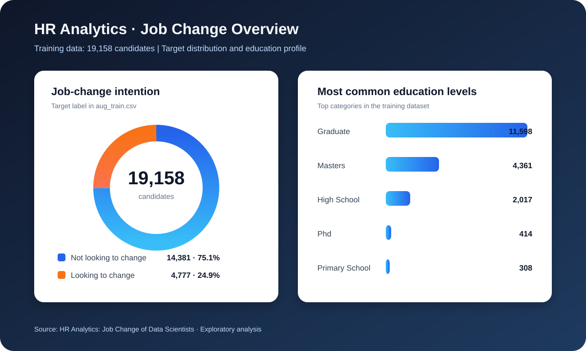

# 👥 HR Analytics — Job Change Analysis

An exploratory data analysis project based on the **HR Analytics: Job Change of Data Scientists** dataset. It investigates which candidate, education, experience, company, and training characteristics are associated with a person's intention to change jobs.

## 🎯 Problem Statement

The analysis explores the \`target\` variable:

- \`0\` — not looking for a job change
- \`1\` — looking for a job change

This project focuses on exploratory insights rather than claiming causal relationships.

## 📊 Dataset

- **Source:** [HR Analytics: Job Change of Data Scientists](https://www.kaggle.com/datasets/arashnic/hr-analytics-job-change-of-data-scientists)
- **Training records:** 19,158
- **Test records:** 2,129
- **Training file:** [aug_train.csv](./aug_train.csv)
- **Test file:** [aug_test.csv](./aug_test.csv)
- **Submission template:** [sample_submission.csv](./sample_submission.csv)

Important features include city development index, gender, relevant experience, university enrollment, education, major discipline, experience, company size, company type, previous-job gap, training hours, and the target label.

## 🔎 Analysis Covered

- Dataset shape, data types, unique values, duplicates, and descriptive statistics
- Numerical correlations and feature distributions
- Categorical summaries and train-versus-test comparisons
- Target distribution and target-group comparisons
- Missing-value inspection and outlier detection
- Univariate, bivariate, and multivariate visualizations
- Correlation heatmaps and pairwise relationships

## 🗂️ Project Structure

~~~text
HR Analytics/
├── HR_Analytics.ipynb
├── aug_train.csv
├── aug_test.csv
├── sample_submission.csv
├── hr_job_change_overview.svg
└── README.md
~~~

## 🛠️ Technology Stack

- Python
- pandas and NumPy
- Matplotlib and Seaborn
- Jupyter Notebook

## 🚀 Getting Started

~~~bash
pip install pandas numpy matplotlib seaborn jupyter
jupyter notebook HR_Analytics.ipynb
~~~

Run the notebook from top to bottom. If you download the dataset independently, update the file paths in the notebook to point to the local CSV files.

## 📌 Notes

This is an exploratory analysis project. Candidate and employee-related data should be handled responsibly, and correlations should not be interpreted as proof of causation.

## 👤 Author

**Vishal Yadav**

Part of the [EDA Project Portfolio](https://github.com/Vishal123-tech/EDA-PROJECT-).
