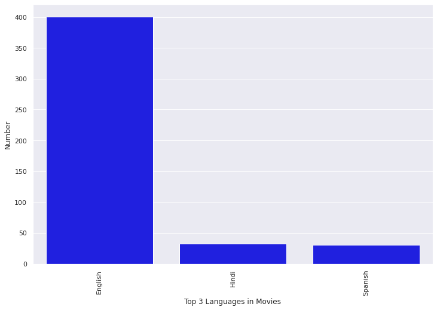

# 🎬 Netflix Original Films — Exploratory Data Analysis

An exploratory data analysis project studying Netflix original films, documentaries, and specials through genre, language, runtime, release year, and IMDb score.

> **Project question:** What patterns can we discover in Netflix original content, its languages, genres, runtimes, release years, and audience ratings?

---

## 📌 Project overview

This project turns a catalogue of Netflix original films into clear, visual insights. The notebook combines data inspection, descriptive statistics, filtering, correlation analysis, outlier analysis, and visualization.

The analysis explores:

- The languages represented in Netflix original films
- IMDb scores for documentaries released between January 2019 and June 2020
- Genres with the highest IMDb ratings among English-language films
- Average runtime of Hindi-language films
- Genre and language distribution
- The highest-rated and longest-running films
- Release trends by year
- The relationship between runtime and IMDb score
- Outliers in runtime and IMDb score

## 🗂️ Repository contents

~~~text
Netflix Originals/
├── Netflix_Originals.ipynb   # Complete exploratory analysis
├── NetflixOriginals.csv      # Source dataset
├── netflix-analysis.png      # README visualization
└── README.md                 # Project documentation
~~~

## 🧾 Dataset

The dataset contains **584 Netflix original films, documentaries, and specials** with six fields:

| Field | Type | Description |
| --- | --- | --- |
| Title | Text | Name of the film or special |
| Genre | Categorical | Content genre |
| Premiere | Date | Original release date |
| Runtime | Numeric | Runtime in minutes |
| IMDB Score | Numeric | IMDb audience score |
| Language | Categorical | Primary or listed film language(s) |

## 🔍 Analysis workflow

1. Import pandas, Matplotlib, Seaborn, and Plotly.
2. Load and inspect the Netflix Originals dataset.
3. Review data types, descriptive statistics, and unique categories.
4. Analyze languages, genres, runtimes, release dates, and IMDb scores.
5. Filter records to answer focused business and entertainment questions.
6. Create charts for rankings, distributions, trends, and relationships.
7. Examine correlation and identify potential outliers.

## 📈 Key visual analysis

### Language distribution

The notebook identifies the most common languages in the catalogue. English is the dominant language in the dataset, followed by Hindi and Spanish among the most frequently represented languages.

### Ratings and genres

IMDb scores are compared across genres and language groups to identify highly rated content and genre-level patterns.

### Runtime and release trends

The analysis ranks the longest films, measures runtime patterns, and identifies the years with the highest number of releases and total runtime.

## 💡 Key takeaways

- English-language content represents the largest share of the catalogue.
- The dataset includes a broad mix of documentaries, dramas, comedies, thrillers, and other genres.
- IMDb scores and runtime are analyzed together to assess whether longer films tend to receive higher audience ratings.
- Release-year analysis highlights how Netflix original production changed over time.
- Outlier analysis helps identify unusually short, long, highly rated, or low-rated titles.

> These findings describe the available dataset and should not be treated as a complete representation of all Netflix content or global audience preferences.

## 🛠️ Tech stack

- Python
- pandas
- Matplotlib
- Seaborn
- Plotly
- Jupyter Notebook

## 🚀 Getting started

Clone the repository and open the project folder:

~~~bash
git clone https://github.com/Vishal123-tech/EDA-PROJECT-.git
cd EDA-PROJECT-/Netflix\ Originals
~~~

Install the required libraries:

~~~bash
python -m pip install pandas matplotlib seaborn plotly jupyter
~~~

Launch the notebook:

~~~bash
jupyter notebook Netflix_Originals.ipynb
~~~

When running locally, make sure the notebook loads the included CSV file:

~~~python
pd.read_csv("NetflixOriginals.csv", encoding="ISO-8859-1")
~~~

## 📚 Data source and attribution

The project uses the **Netflix Original Films IMDb Scores** dataset, sourced from Kaggle. Please review the original dataset license and attribution requirements before redistributing or using it commercially.

## 📄 License

No project-specific license has been added. Unless a license is provided, default copyright rules apply to the original work in this repository.
