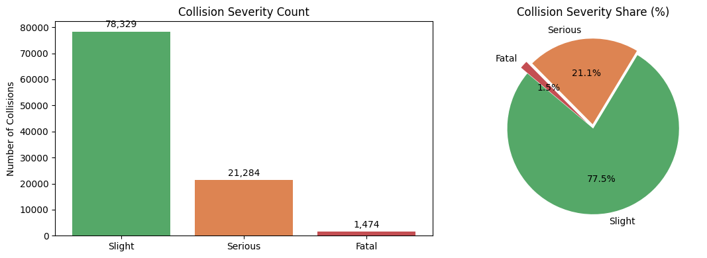
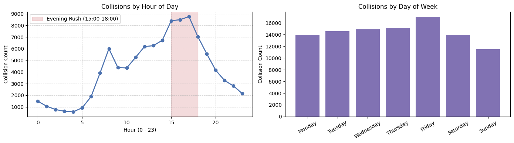
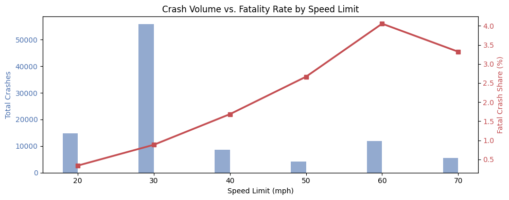

# Road Accident Analysis

An **EDA / Visualization & Statistical Analysis** project exploring 101,087 UK road collisions from 2021. It examines collision severity, peak crash timing, speed-limit lethality, urban/rural exposure, and environmental risk factors.

## Problem Statement

When do crashes happen, how severe are they, and what roadway and environmental conditions surround them?

## Dataset

- **Source:** [UK DfT Road Safety Data, 2021 collisions](https://www.data.gov.uk/dataset/cb7ae6f0-4be6-4935-9277-47e5ce24a11f/road-safety-data)
- **101,087 collisions × 15 columns**
- Includes date, time, severity, vehicles, casualties, speed limit, weather, road surface, urban/rural area, road type, longitude, and latitude.

## Project Structure

~~~text
Road Accident Analysis/
├── 01_eda.ipynb
├── 02_analysis.ipynb
├── road_accident_severity.png
├── road_accident_peak_timing.png
├── road_accident_speed_fatality.png
├── utils.py
├── requirements.txt
├── README.md
└── data/accidents.csv
~~~

## Key Findings

- **77.5%** of collisions were slight, **21.1%** serious, and **1.5%** fatal.
- Crashes peak on Fridays and during the **15:00–18:00** evening rush hour.
- Around **68%** of collisions occur in urban areas, while rural and high-speed roads are deadlier per crash.
- Fatality share rises from about **1.0% on 30mph roads** to roughly **3.5%–4.2% on 60–70mph roads**.
- Single carriageways account for approximately **72.3%** of collisions.
- Chi-square tests show statistically significant relationships between speed limit, urban/rural area, light conditions, and collision severity.

## Tech Stack

Python, pandas, NumPy, Matplotlib, Seaborn, SciPy, and Jupyter Notebook.

## Getting Started

~~~bash
pip install -r requirements.txt
jupyter notebook 01_eda.ipynb
~~~

Run the notebooks in order: 01_eda.ipynb → 02_analysis.ipynb.

## Author

**Vishal Yadav**
