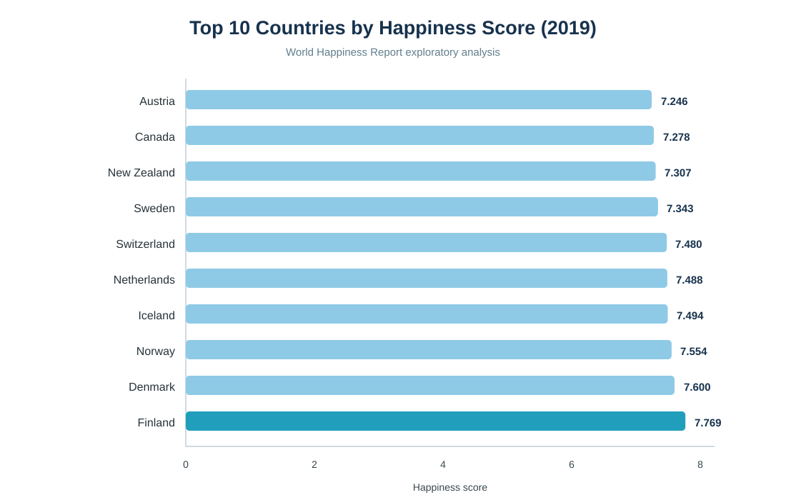
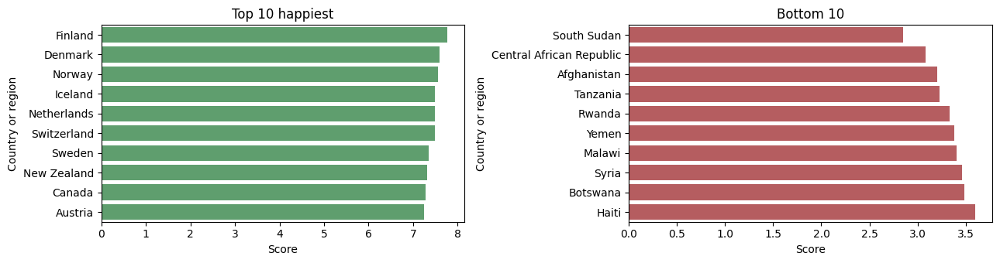
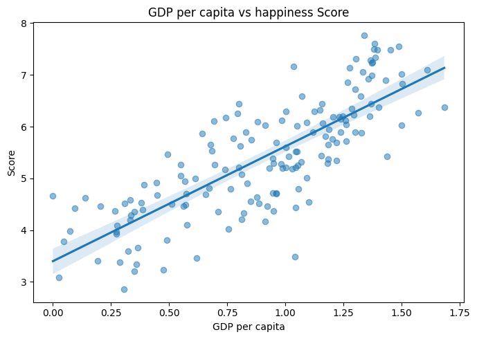
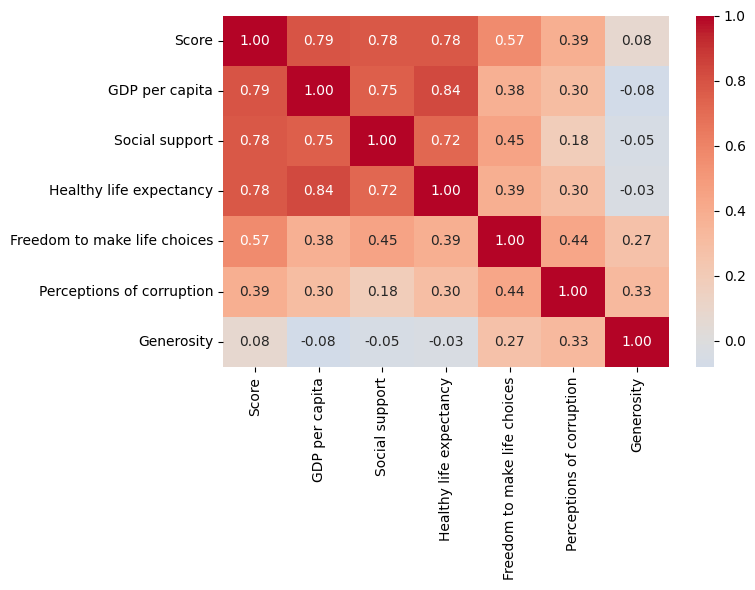

# 🌍 World Happiness Report Analysis

An exploratory data analysis project using the **2019 World Happiness Report** to understand how economic conditions, health, social support, freedom, generosity, and perceived corruption relate to national happiness.

The analysis covers **156 countries** and combines ranking analysis, correlation exploration, and visual storytelling.

## 🎯 Objectives

- Identify countries with the highest and lowest happiness scores.
- Explore relationships between happiness and contributing factors.
- Compare GDP, health, social support, freedom, generosity, and corruption perceptions.
- Build reproducible notebooks with clear visualizations.

## 📊 Dataset

- **Source:** [World Happiness Report 2019](https://worldhappiness.report/)
- **Coverage:** 156 countries
- **Year:** 2019
- **File:** data/happiness.csv
- **Main fields:** Overall rank, country, happiness score, GDP per capita, social support, healthy life expectancy, freedom, generosity, and perceptions of corruption.

## 🔎 Key Findings

- Finland, Denmark, and Norway rank among the happiest countries.
- South Sudan, the Central African Republic, and Afghanistan appear among the least happy countries.
- Happiness has a strong positive relationship with GDP per capita, healthy life expectancy, and social support.
- Freedom shows a moderate relationship with happiness, while perceived corruption shows a weaker relationship.
- Generosity has the weakest relationship among the major contributing factors examined.

## 🗂️ Project Structure

~~~text
World Happiness Report Analysis/
├── 01_eda.ipynb
├── 02_analysis.ipynb
├── data/happiness.csv
├── world_happiness_top10.svg
├── world_happiness_rankings.png
├── world_happiness_gdp_scatter.png
├── world_happiness_correlation_heatmap.png
├── utils.py
├── requirements.txt
└── README.md
~~~

## 🛠️ Technology Stack

Python · pandas · NumPy · Matplotlib · Seaborn · Jupyter Notebook

## 🚀 Getting Started

~~~bash
git clone https://github.com/Vishal123-tech/EDA-PROJECT-.git
cd EDA-PROJECT-/World%20Happiness%20Report%20Analysis
pip install -r requirements.txt
jupyter notebook 01_eda.ipynb
~~~

Run the notebooks from top to bottom to reproduce the analysis and visualizations.

## 📌 Note

This is an exploratory analysis project. The findings describe relationships in the 2019 data and should not be interpreted as proof of causation.

## 👤 Author

**Vishal Yadav**
